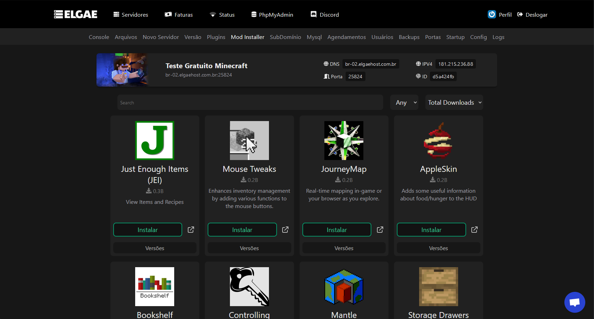

---
layout:
  title:
    visible: true
  description:
    visible: true
  tableOfContents:
    visible: true
  outline:
    visible: true
  pagination:
    visible: false
---

# Catálogo de hospedagem

Catálogo de todas as hospedagens observadas, juntamente com os pontos, links e anotações, apenas são considerados os planos de Minecraft.

A ordem no qual as hospedagens estão organizadas são as que mais batem com os pontos observados em ordem decrescente, funcionando em um meio de nota de 0 a 10, como explicado na página anterior.

## <mark style="color:red;">Importante</mark>

Em algumas avaliações foi entrado em contato com o suporte, isso será feito com todas as hospedagens no qual não dão informações suficientes em seus websites para a avaliação completa, estará claramente descrito caso alguma informação foi apenas possível conseguir pelo suporte, e com uma lista na página da hospedagem desta documentação com todos os pontos que foram apenas pegos pelo suporte.\
Caso alguma informação apenas foi possível de ser pega entrando em contato com o suporte, não irá contar na pontuação da hospedagem, e consequentemente em seu ranking, entretanto, ainda estará disponível nessa comparação. O objetivo dessa documentação é trazer maior transparência as hospedagens de Minecraft assim como compartilhar informações básicas sobre elas.\
Algumas hospedagens estão com avaliações feitos de maneiras antigas, estamos ativamente re-analisando todas para ficarem com o mesmo método.

## Utilização de cores na aba de informações

* <mark style="color:green;">Verde</mark>: Cumpriu totalmente o ponto observado
* <mark style="color:orange;">Laranja</mark>: Cumpriu parcialmente o ponto observado
* <mark style="color:red;">Vermelho</mark>: Não cumpriu o ponto observado

Mais informações sobre os pontos observados estará disponível na página dedicada àquela hospedagem dentro dessa documentação.

## MagnoHost.com.br | 6.5 

Data da avaliação - 25/01/2024

<table><thead><tr><th width="192">Ponto observado</th><th width="240">Informações</th><th width="218">Anotações</th><th>Pontos</th></tr></thead><tbody><tr><td>Localização</td><td>Estados Unidos - Miami</td><td></td><td></td></tr><tr><td>Legalidade</td><td><a href="https://cnpj.biz/53000870000127"><mark style="color:orange;">MEI</mark></a></td><td>Registrado de forma incorreta - <a href="https://docs.artbenedetti.com/iniciando-um-servidor/escolhendo-uma-hospedagem/legais">Explicação</a></td><td>15</td></tr><tr><td>Sistema Financeiro</td><td><mark style="color:red;">WHMCS Crackeado</mark></td><td></td><td>0</td></tr><tr><td>Avaliação</td><td><ul><li><a href="https://br.trustpilot.com/review/magnohost.com.br"><mark style="color:orange;">TrustPilot</mark></a></li><li><a href="https://www.reclameaqui.com.br/empresa/magnohost/"><mark style="color:orange;">ReclameAqui</mark></a></li></ul></td><td>TrustPilot e ReclameAqui estão citados no website, entretanto, não estão verificados</td><td>10</td></tr><tr><td>Uptime SLA</td><td><mark style="color:green;">99,97% - 5X</mark></td><td>Citado nos termos</td><td>10</td></tr><tr><td>Hardware</td><td>- <mark style="color:green;">Ryzen 9 3950X - 2,706</mark> - <mark style="color:green;">Ryzen 9 5950X - 3,466</mark></td><td>A seleção é dependente da capacidade da máquina, preço pelos dois é o mesmo.  <mark style="color:red;">Pagando o mesmo valor para o mesmo plano, pode ter uma diferença máxima de performance teórica e sintética de até 28% dependendo do processador</mark></td><td>25</td></tr><tr><td>Proteção DDoS</td><td><mark style="color:red;">Citada - 200Tbps</mark></td><td>Não cita qual é o provedor</td><td>0</td></tr><tr><td>Backups on/off-site</td><td><mark style="color:green;">off-site</mark></td><td>Dependendo do plano contratado, poderá ter 1-3 backups off-site</td><td>0</td></tr><tr><td>Compartilhamento de recursos</td><td><mark style="color:green;">Dedicados</mark></td><td>Segundo o website e após confirmação com o suporte, a MagnoHost gerencia as VPS, colocando o painel pterodactyl, nas quais tem recursos dedicados, completando esse requisito.  <mark style="color:red;">Entretanto, por essa informação e plano estar fora da categoria de Minecraft, não estará contando pontos.</mark></td><td>0</td></tr><tr><td>Práticas insustentáveis</td><td>- <mark style="color:green;">Planos vitalícios</mark> - <mark style="color:green;">Planos ilimitados</mark> - <mark style="color:green;">Fração inconsistente</mark></td><td>Todos os planos estão com uma fração consistente.</td><td>30</td></tr><tr><td>Transparência</td><td>- <mark style="color:green;">Página de uptime</mark> - <mark style="color:green;">Página de recursos</mark> - <mark style="color:green;">Produtos/serviços</mark></td><td><ul><li>Contém uma página de uptime com o uso de recursos dos nodes US 1 e 2</li><li>Se demonstrou clara na transparência dos serviços prestados</li></ul></td><td>25</td></tr><tr><td>Adicionais</td><td>- <mark style="color:green;">Server Splitter</mark> - <mark style="color:green;">Seleção de versão</mark> - <mark style="color:green;">Subdomínios</mark> - <mark style="color:green;">Lixeira</mark></td><td></td><td>6</td></tr></tbody></table>

***

A MagnoHost ofereceu no dia 24/01/2024 uma hospedagem de testes para pegar essas informações, qualquer e avaliação aqui não está nem a favor ou contra a MagnoHost devido a este fato.

Informações conseguidas pelo suporte

MagnoHost tem falta de transparência em seu website e página de produtos sobre algumas informações, entretanto, as informações faltantes não são significativas na experiência:

* Divisor de servidor: O limite de quantas divisões pode ser feitas é dependente do plano, entretanto, pode ser aumentado apenas por entrar em contato com o suporte.
* Recursos dedicados: Segundo o suporte, gerenciam e instalam Pterodactyl nas VPS da empresa, no qual estão com recursos dedicados.



<figure><figcaption></figcaption></figure>



<figure><figcaption></figcaption></figure>



<figure><figcaption></figcaption></figure>

O seletor de versões tem os seguintes softwares disponíveis:

* Paper Spigot
* Mohist
* PufferFish
* Purpur
* Magma
* ArchLight
* Spigot
* PocketMine



<figure><figcaption></figcaption></figure>



<figure><figcaption></figcaption></figure>



**Cálculo de pontuação**:

`(<Pontuação>*10)/<Pontuação Máxima>=Nota` -> (`131*10)/200=Nota` -> 6.55

## BedHosting.com.br | 4.5 

Data da avaliação - 24/01/2024

<table><thead><tr><th width="192">Ponto observado</th><th width="240">Informações</th><th width="218">Anotações</th><th>Pontos</th></tr></thead><tbody><tr><td>Localização</td><td>Brasil - São Paulo ou Minas Gerais Estados Unidos - Virgínia Canadá - Quebec</td><td>Sem mais informações sobre a localização específica no website da empresa. Foi possível saber a localização mais exata entrando em contato com o suporte.</td><td></td></tr><tr><td>Legalidade</td><td><a href="https://cnpj.biz/48964455000153"><mark style="color:orange;">MEI</mark></a></td><td>Registrado de forma incorreta -  <a href="https://docs.artbenedetti.com/iniciando-um-servidor/escolhendo-uma-hospedagem/legais">Explicação</a></td><td>15</td></tr><tr><td>Sistema Financeiro</td><td><mark style="color:green;">WHMCS</mark></td><td>Autorizado a utilizar pelo WHMCS</td><td>20</td></tr><tr><td>Avaliação</td><td><mark style="color:red;">TrustPilot</mark></td><td>TrustPilot da empresa existe, entretanto, não está citado no site e nem verificado</td><td>0</td></tr><tr><td>Uptime SLA</td><td><mark style="color:green;">99,7% - 2x</mark></td><td>Sem compensação citada nos termos, só foi possível descobrir após entrar em contato com o suporte, sendo 2x.  <mark style="color:red;">Pela compensação não estar citada nos termos ou website, não arrecadará pontos.</mark></td><td>0</td></tr><tr><td>Hardware</td><td>
<strong>Brasil</strong>
<ul><li>Basic: <mark style="color:red;">ARM 3.0GHz  ou Xeon E5-2690v4 -</mark> 2,075</li><li>Plus: <mark style="color:green;">Ryzen 9 5950X -</mark> 3,466</li><li>Ultra: <mark style="color:green;">Ryzen 9 7950X -</mark> 4,297</li></ul>
<strong>Estados Unidos</strong>
<ul><li><mark style="color:green;">Ryzen 5 5600X -</mark> 3,361</li></ul>
<strong>Canadá</strong>
<ul><li><mark style="color:green;">Ryzen 7 5800X -</mark> 3,448</li></ul></td><td>

<ul><li>Só foi possível saber que a hospedagem Basic também pode ser entregue com o Xeon pelo suporte, a escolha é dependente da capacidade.</li></ul><ul><li>Só foi possível saber que o ARM é de 3.0GHz após entrar em contato com o suporte.</li></ul></td><td>20</td></tr><tr><td>Proteção DDoS</td><td><mark style="color:green;">228Tbps - Cloudflare Magic Transit</mark></td><td>Proteção DDoS está citada, em alguns casos como "BedGuard", na página do plano Ultra tras uma capacidade de 228Tbps, mas sem o provedor. Após entrar em contato com o suporte foi possível descobrir que é o Magic Transit da Cloudflare, com capacidade de 228Tbps.  <mark style="color:red;">Entretanto, por essa informação apenas ser encontrada pelo suporte, não arrecadará pontos.</mark></td><td>0</td></tr><tr><td>Backups on/off-site</td><td><mark style="color:green;">on-site e off-site</mark></td><td>Só foi possível descobrir, em contato com o suporte, os backups feitos pelos clientes ficam na mesma máquina, entretanto, backups completos do node são feitos periodicamente para outro local.</td><td>10</td></tr><tr><td>Compartilhamento de recursos</td><td><mark style="color:red;">Sem informação</mark></td><td>Em caso de falta de informação, é considerado compartilhado</td><td>0</td></tr><tr><td>Práticas insustentáveis</td><td>- <mark style="color:green;">Planos vitalícios</mark> - <mark style="color:green;">Planos ilimitados</mark> - <mark style="color:red;">Fração inconsistente</mark></td><td>Fração inconsistente de recursos em todos os planos referente ao processador e RAM, assim como o disco (10GB padrão, independente do plano)</td><td>20</td></tr><tr><td>Transparência</td><td>- <mark style="color:green;">Página de uptime</mark> - <mark style="color:red;">Página de recursos</mark> - <mark style="color:red;">Produtos/serviços</mark></td><td>

<ul><li>Falta extrema de transparência do website e dos produtos/servicos, estas foram discutidas e anotadas na <a href="broken-reference">página específica da BedHosting</a>.</li></ul><ul><li>Contém uma página de Uptime, separada por nodes, mas não contém de uso de recursos.</li></ul></td><td>5</td></tr><tr><td>Adicionais</td><td><mark style="color:green;">Subdomínio</mark></td><td>Sem mais adicionais no painel</td><td>1</td></tr></tbody></table>

***

A BedHosting ofereceu no dia 24/01/2024 uma hospedagem de testes para pegar essas informações, qualquer e avaliação aqui não está nem a favor ou contra a Bedhosting devido a este fato.

Informações conseguidas pelo suporte

BedHosting tem falta de transparência em seu website e página de produtos sobre algumas informações, as seguintes apenas foi possível conseguir com o suporte ou de formas externas:

* Localização: A localização específica além do país não estava disponível no website, apenas foi possível descobrir que era São Paulo/Minas Gerais para o Brasil, Virginia para os Estados Unidos e Quebec para o Canadá por meio do suporte.
* Processador do Basic: Só foi possível descobrir que o plano Basic também pode vir com o processador Xeon E5-2690v4 por meio de contato com o suporte
* Processador da hospedagem dos Estados Unidos: Não está citado no site e em nenhum lugar, apenas está como "AMD Ryzen 5", sem especificação do modelo, com o suporte foi capaz de descobrir que é o Ryzen 5 5600X
* Proteção DDoS: Só foi possível descobrir que a proteção DDoS é da Cloudflare Magic Transit após entrar em contato com o suporte.
* Compensação SLA: Só foi possível descobrir que era de 2 vezes após entrar em contato com o Suporte.
* Backup on-site e off-site: Só foi possível descobrir pelo suporte que são feitos backups periódicos das máquinas de maneira off-site, entretanto, os backups feitos pelos clientes ainda são on-site:
  * > O backup feito diretamente pelo site de gerenciamento (Pterodactyl) é on-site ( no mesmo datacenter ) todavia efetuamos backups diarios (todo dia as 09:00AM) de todas os nodes em um outro datacenter destinado apenas para backup (off-site)



<figure><figcaption></figcaption></figure>



<figure><figcaption></figcaption></figure>



Cálculo de pontuação:

`(<Pontuação>*10)/<Pontuação Máxima>=Nota`-> `910/200=Nota` -> 4.55

## Syrtex.com.br | 4.1 

Data da avaliação - 26/01/2024&#x20;

<table><thead><tr><th width="192">Ponto observado</th><th width="240">Informações</th><th width="218">Anotações</th><th>Pontos</th></tr></thead><tbody><tr><td>Localização</td><td>Brasil - São Paulo / Rio Grande do Sul / Rio de Janeiro Estados Unidos - Miami</td><td>Pelo suporte foi possível descobrir as cidades em específico.</td><td></td></tr><tr><td>Legalidade</td><td><a href="https://cnpj.biz/49565390000136"><mark style="color:orange;">MEI</mark></a></td><td>Registrado de forma incorreta - <a href="../../escolhendo-uma-hospedagem/legais.md">Explicação</a></td><td>15</td></tr><tr><td>Sistema Financeiro</td><td><mark style="color:red;">WHMCS Não Autorizado</mark></td><td></td><td>0</td></tr><tr><td>Avaliação</td><td><a href="https://www.trustpilot.com/review/syrtex.cloud"><mark style="color:green;">TrustPilot</mark></a></td><td></td><td>10</td></tr><tr><td>Uptime SLA</td><td><mark style="color:green;">99.9% - 1x</mark></td><td>Pelo suporte foi possível foi possível descobrir o uptime e SLA garantido.  <mark style="color:red;">Pelo uptime e SLA não estar citada nos termos ou website, não arrecadará pontos.</mark></td><td>0</td></tr><tr><td>Hardware</td><td>Brasil: - <mark style="color:green;">Ryzen 9 5900X -</mark> 3,471 - <mark style="color:green;">Ryzen 9 5950X -</mark> 3,466  Estados Unidos: - <mark style="color:green;">Ryzen 9 3900X -</mark> 2,707 - <mark style="color:green;">Ryzen 9 5900X -</mark> 3,471</td><td><mark style="color:red;">Diferente do que está listado no website para o plano dos estados Unidos e para o plano ilimitado, segundo o suporte, os processadores são os mesmos independente do plano, apenas da localização.</mark>  <mark style="color:red;">Assim ficando com discrepância de processadores comparado ao website (Ilimitado com Ryzen 5/9 e Estados Unidos com Ryzen 9 5900 e 5950X)</mark></td><td>25</td></tr><tr><td>Proteção DDoS</td><td><mark style="color:green;">SyrtexShield - 200Tbps</mark></td><td>Relata ser uma implementação própria da Syrtex, mais informações a baixo.  <mark style="color:red;">Pela capacidade não estar citada nos termos ou website, não arrecadará pontos.</mark></td><td>0</td></tr><tr><td>Backups on/off-site</td><td><mark style="color:red;">on-site</mark></td><td>Os backups realizados pelo cliente, segundo o suporte, fica salvo dentro da mesma máquina do servidor e em outra máquina, entretanto, por estar no mesmo datacenter ainda é considerado on-site.</td><td>0</td></tr><tr><td>Compartilhamento de recursos</td><td><mark style="color:green;">Dedicados</mark></td><td>Os planos da série "Dedicado" relatam ter recursos dedicados, enquanto cita apenas RAM dedicada, segundo o suporte, o processador também é dedicado.</td><td>10</td></tr><tr><td>Práticas insustentáveis</td><td>- <mark style="color:green;">Planos vitalícios</mark> - <mark style="color:red;">Planos ilimitados</mark> - <mark style="color:red;">Não é possível avaliar fração inconsistente</mark></td><td><ul><li>Contém RAM ilimitada em seus planos ilimitados</li></ul><ul><li>Pela falta de informações sobre os recursos do serviço é impossível avaliar a fração inconsistente.</li></ul></td><td>10</td></tr><tr><td>Transparência</td><td>- <mark style="color:green;">Página de uptime</mark> - <mark style="color:red;">Página de recursos</mark> - <mark style="color:red;">Produtos/serviços</mark></td><td><ul><li>Contém uma página de uptime com o histórico</li></ul><ul><li>Falta muita informação sobre os recursos e informações de planos dos serviços oferecidos, variando desde disco, processador, proteção e localização</li></ul></td><td>5</td></tr><tr><td>Adicionais</td><td>
<mark style="color:green;">- Server Splitter</mark>

<mark style="color:green;">- Subdomínios</mark> <mark style="color:green;">- Loja de servidor inclusa (PayCraft)</mark>
</td><td>- Loja de servidor inclusa em alguns planos específicos</td><td>7</td></tr></tbody></table>

***

Informações conseguidas pelo suporte

Syrtex tem falta de transparência em seu website e página de produtos sobre algumas informações, as seguintes apenas foi possível conseguir com o suporte ou de formas externas:

* Localização da hospedagem: No website está apenas citado Estados Unidos ou Brasil, sem a localização mais específica, como MIami, Rio Grande do Sul, Rio de Janeiro e São Paulo.
* Processador: Pelo suporte foi possível descobrir uma discrepância dos processadores citados no website e dos processadores utilizados, com tanto Estados Unidos e Brasil utilizando Ryzen 9 5900/5950X e o plano ilimitado citado como Ryzen 5/9, diferente do oferecido. Sendo Ryzen 9 3900X/5900X para os Estados Unidos e Ryzen 9 5900X/5950X para o Brasil.
* Proteção DDoS: Pelo suporte foi possível descobrir mais informações sobre a proteção DDoS da Syrtex, relatando o seguinte:
  * > 1. A proteção Anti DDoS da nossa Shield opera baseando-se em mascaras de rede e sub rede, com protocolos e interfaces limitados, que por sua vez, operam de acordo com a degradação parcial do serviço, ou seja, o protocolo utilizado faz com que o serviço que seja afetado continue operando normalmente, isento de ataques. Operamos com o desvio para redes da cloud flare integrada para melhor performance.
    > 2. Também com uma série de protocolos de segurança e proteção privadas
    > 3. Garantimos +200 TBps de proteção

<!---->

* Plano Dedicado: Segundo o website apenas está citado RAM Dedciada, entretanto, segundo o suporte, o processador também é dedicado, enquanto é incomum apenas um recurso ser dedicado e não o outro, ainda é possível encontrar essa prática em algumas hospedagens.
* Uptime e SLA: Apenas foi possível descobrir pelo suporte o uptime e SLA, sendo de 99.9% com compensação de 1x (Cada dia de downtime ganhará um dia a mais).
* Backups classificados como on-site: Foi possível saber pelo suporte que os backups são on-site.



<figure><figcaption></figcaption></figure>



<figure><figcaption></figcaption></figure>



<figure><figcaption></figcaption></figure>



Cálculo de pontuação:

`(<Pontuação>*10)/<Pontuação Máxima>=Nota`-> `820/200=Nota` -> 4.1

## XMXCloud.net | 4 

Data da avaliação - 24/01/2024&#x20;

<table><thead><tr><th width="192">Ponto observado</th><th width="240">Informações</th><th width="218">Anotações</th><th>Pontos</th></tr></thead><tbody><tr><td>Localização</td><td>Brasil - São Paulo Estados Unidos - Miami/Nova Iorque</td><td>Informações da cidade específica estão na aba de produtos do WHMCS, não no website principal</td><td></td></tr><tr><td>Legalidade</td><td><mark style="color:red;">CNPJ ausente</mark></td><td></td><td>0</td></tr><tr><td>Sistema Financeiro</td><td><mark style="color:green;">WHMCS</mark></td><td>Autorizado a utilizar pelo WHMCS</td><td>20</td></tr><tr><td>Avaliação</td><td><mark style="color:red;">Sem website de avaliação</mark></td><td></td><td>0</td></tr><tr><td>Uptime SLA</td><td><mark style="color:red;">Sem informação sobre Uptime Garantido</mark></td><td>Uptime Garantido está ausente nos termos e no website, entretanto, a compensação está citada nos termos, sendo de 2x ("Para cada dia de indisponibilidade do serviço, o cliente receberá dois dias de bônus")</td><td>0</td></tr><tr><td>Hardware</td><td>
Brasil: - <mark style="color:green;">Xeon E-2356G</mark> - 3,368

Estados Unidos: - <mark style="color:green;">Ryzen 9 7900X -</mark> 4,284
</td><td>Enquanto utiliza um Xeon no plano brasileiro, ele é totalmente capaz de aguentar servidores comparado a sua performance single-core, entretanto, é apenas 6 núcleos e 12 threads</td><td>25</td></tr><tr><td>Proteção DDoS</td><td><mark style="color:red;">Citada</mark></td><td>Enquanto diz que oferece proteção DDoS, não cita em qualquer momento a capacidade ou o provedor.</td><td>0</td></tr><tr><td>Backups on/off-site</td><td><mark style="color:green;">on-site e off-site</mark></td><td>Após entrar em contato com o suporte, foi possível descobrir que a empresa reliazada backups periódicos para uma localização off-site, enquanto os backups feitos pelo painel continuam on-site.</td><td>10</td></tr><tr><td>Compartilhamento de recursos</td><td><mark style="color:red;">Sem informação</mark></td><td>Em caso de falta de informação, é considerado compartilhado</td><td>0</td></tr><tr><td>Práticas insustentáveis</td><td>- <mark style="color:green;">Planos vitalícios</mark> - <mark style="color:green;">Planos ilimitados</mark> - <mark style="color:red;">Fração inconsistente</mark></td><td>A empresa não diz qual o limite de processador alocado a cada plano, entretanto, a comparação de GBs de RAM e GBs de armazenamento está inconsistente.</td><td>20</td></tr><tr><td>Transparência</td><td>- <mark style="color:red;">Página de uptime</mark> - <mark style="color:red;">Página de recursos</mark> - <mark style="color:red;">Produtos/serviços</mark></td><td><ul><li>A empresa não contém uma página de uptime e nem mesmo da utilização de recursos de cada node</li></ul><ul><li>A empresa não é clara sobre os serviços, não dando dados específicos sobre a localização na website principal, limite de processador, e a proteção garantida.</li></ul></td><td>0</td></tr><tr><td>Adicionais</td><td>- <mark style="color:green;">Subdomínios</mark> - <mark style="color:green;">Instalador de versões</mark> - <mark style="color:green;">Server Splitter</mark></td><td><ul><li>Instalador de versões e Server Splitter não citados no website</li></ul><ul><li>Após entrar em contato com o suporte, foi possível descobrir que o Server Splitter apenas funciona para planos acima de 8GB de ra</li></ul></td><td>5</td></tr></tbody></table>

***

Informações conseguidas pelo suporte

### Informações conseguidas pelo suporte

XMXCloud tem falta de transparência em seu website e página de produtos sobre algumas informações, as seguintes apenas foi possível conseguir com o suporte:

* Backup on-site e off-site: Só foi possível descobrir pelo suporte que são feitos backups periódicos das máquinas de maneira off-site, entretanto, os backups feitos pelos clientes ainda são on-site.
* Server Splitter: Só foi possível descobrir pelo suporte que penas está disponível para planos de 8GB ou superiores.

Informações conseguidas pelo painel

Essas são as informações que não foram citadas no website mas que foi possível pegar apenas tendo acesso ao painel

* Instalador de versões: Não está citado que inclui um instalador de versões no website, isso não é um ponto negativo diretamente.
* Server Splitter: Não está citado que inclui um server splitter no website, isso não é um ponto negativo diretamente.



<figure><figcaption></figcaption></figure>



<figure><figcaption></figcaption></figure>



<figure><figcaption></figcaption></figure>



<figure><figcaption></figcaption></figure>



Cálculo de pontuação:

`(<Pontuação>*10)/<Pontuação Máxima>=Nota`-> `800/200=Nota` -> 4

***

## <mark style="color:red;">As hospedagens abaixo foram avaliadas de um modo antigo, as informações poderão mudar e não tem uma nota de 0 a 10</mark>

### ElgaeHost.com.br - 23/01/2024

<table><thead><tr><th width="208">Ponto observado</th><th width="240">Informações</th><th>Anotações</th></tr></thead><tbody><tr><td>Localização</td><td>Brasil - Cotia/São Paulo</td><td></td></tr><tr><td>Legalidade</td><td><a href="https://cnpj.biz/46853968000161"><mark style="color:orange;">MEI</mark></a></td><td>Registrado de forma incorreta -  <a href="https://docs.artbenedetti.com/iniciando-um-servidor/escolhendo-uma-hospedagem/legais">Explicação</a></td></tr><tr><td>Avaliação</td><td><ul><li><a href="https://br.trustpilot.com/review/elgaehost.com.br"><mark style="color:green;">TrustPilot</mark></a></li><li><a href="https://www.reclameaqui.com.br/empresa/elgae-host/"><mark style="color:orange;">ReclameAqui</mark></a></li></ul></td><td><ul><li>ReclameAqui não é verificado</li></ul></td></tr><tr><td>Uptime SLA</td><td><mark style="color:red;">Inconsistente</mark></td><td><ul><li>Compensação não citada</li><li>Ausente nos termos</li><li>Página inicial relata 99%, página de produtos relata 99.99%</li></ul></td></tr><tr><td>Hardware</td><td><mark style="color:green;">Ryzen 9 7900X -</mark> 4,284 <mark style="color:green;">Ryzen 9 7950X -</mark> 4,297</td><td></td></tr><tr><td>Proteção DDoS</td><td><mark style="color:green;">228Tbps</mark></td><td>Provido pela Cloudflare Magic Transit</td></tr><tr><td>Backups on/off-site</td><td><mark style="color:red;">Sem informação</mark></td><td>Em caso de falta de informação, é considerado on-site</td></tr><tr><td>Compartilhamento de recursos</td><td><mark style="color:red;">Compartilhados</mark></td><td>Plano com recursos dedicados não foi lançado, entretanto, está nos planos.</td></tr><tr><td>Práticas insustentáveis</td><td><ul><li><mark style="color:red;">Planos ilimitados</mark></li><li><mark style="color:red;">Fração inconsistente</mark></li></ul></td><td>

<ul><li>Recursos ilimitados estão presentes em seus planos básicos</li><li>Fração de recursos inconsistente em seus planos avançados</li></ul></td></tr><tr><td>Transparência</td><td>- <mark style="color:green;">Página de uptime</mark> - <mark style="color:red;">Página de recursos</mark> - <mark style="color:green;">Produtos/serviços</mark></td><td><ul><li>Página de uso de recursos não está presente</li><li>Informações sobre os produtos/serviços se demonstrou clara</li></ul></td></tr><tr><td>Adicionais</td><td><mark style="color:green;">- Instalador de versões</mark> <mark style="color:green;">- Instalador de mods</mark> <mark style="color:green;">- Instalador de plugins</mark> <mark style="color:green;">- Server Splitter</mark> <mark style="color:green;">- Backup de database</mark> <mark style="color:green;">- Loja para servidor (SinceMarket) inclusa</mark></td><td></td></tr></tbody></table>

### ReisHosting.com.br - 24/01/2024

<table><thead><tr><th width="208">Ponto observado</th><th width="240">Informações</th><th>Anotações</th></tr></thead><tbody><tr><td>Localização</td><td>Brasil</td><td>Não especifica a cidad</td></tr><tr><td>Legalidade</td><td><a href="https://cnpj.biz/36317283000147"><mark style="color:green;">CNPJ</mark></a></td><td>Registrado corretamente</td></tr><tr><td>Avaliação</td><td><mark style="color:orange;">TrustPilot</mark> <mark style="color:orange;">ReclameAqui</mark></td><td><ul><li>TrustPilot é verificado, mas não citado no website</li><li>ReclameAqui não é verificado, mas existente e não citado no website</li></ul></td></tr><tr><td>Uptime SLA</td><td><mark style="color:red;">Não citado</mark></td><td>Ausente nos termos e website</td></tr><tr><td>Hardware</td><td>ECO: - <mark style="color:red;">Xeon E5-2650v2 -</mark> 1,685 PRO: - <mark style="color:green;">Ryzen 7 3700X -</mark> 2,662 - <mark style="color:green;">Ryzen 7 3800X -</mark> 2,719 - <mark style="color:green;">Ryzen 7 5700X -</mark> 3,383 - <mark style="color:green;">Ryzen 7 5800X -</mark> 3,448</td><td><ul><li>O processador utilizado na linha ECO foi lançado a mais de 10 anos atrás (Q3'2013)</li><li>O processador de linha PRO é aleatório, entretanto, o 5800X aparenta ser prioridade</li><li><mark style="color:red;">Pagando o mesmo valor para o mesmo plano (PRO), pode ter uma diferença máxima de performance teórica e sintética de até 30% dependendo do processador</mark></li></ul></td></tr><tr><td>Proteção DDoS</td><td><mark style="color:green;">2Tbps</mark></td><td><a href="https://reishosting.com.br/anti-ddos">Proteção DDoS aparenta ser uma implementação própria da ReisHosting</a></td></tr><tr><td>Backups on/off-site</td><td><mark style="color:red;">ECO: on-site</mark> <mark style="color:green;">PRO: off-site</mark></td><td><a href="https://reishosting.com.br/minecraft">Citado na comparação de ECO vs PRO</a></td></tr><tr><td>Compartilhamento de recursos</td><td><mark style="color:red;">Sem informação</mark></td><td>Em caso de falta de informação, é considerado compartilhado</td></tr><tr><td>Práticas insustentáveis</td><td>- <mark style="color:red;">Planos ilimitados</mark> - <mark style="color:red;">Não é possível avaliar fração inconsistente</mark></td><td><ul><li>Existe o plano de RAM Ilimitada com o processador da linha ECO</li><li>Planos PRO relatam ter SSD Ilimitado</li><li>Devido a falta de informação sobre os planos, é impossível avaliar a fração inconsistente</li></ul></td></tr><tr><td>Transparência</td><td>- <mark style="color:green;">Página de uptime</mark> - <mark style="color:red;">Página de recursos</mark> - <mark style="color:red;">Produtos/serviços</mark></td><td><ul><li>Contém uma página de uptime, não é por node</li><li>Falta informação sobre os serviços/produtos que a empresa oferece</li></ul></td></tr><tr><td>Adicionais</td><td>
- <mark style="color:green;">Instalador de mods</mark>

- <mark style="color:green;">Instalador de modpacks</mark> - <mark style="color:green;">Instalador de versões</mark> 

- <mark style="color:green;">Instalador de plugins</mark> - <mark style="color:orange;">Loja para o servidor</mark>
</td><td><ul><li>A loja para o servidor é inclusa por apenas um mês de graça, sem citação de qual é</li></ul></td></tr></tbody></table>

### Syrtex.cloud - 23/01/2024

<table><thead><tr><th width="208">Ponto observado</th><th width="240">Informações</th><th>Anotações</th></tr></thead><tbody><tr><td>Localização</td><td>Brasil - São Paulo / Rio Grande do Sul / Rio de Janeiro Estados Unidos - Miami</td><td>Sem mais informações sobre a cidade em específico</td></tr><tr><td>Legalidade</td><td><a href="https://cnpj.biz/49565390000136"><mark style="color:orange;">MEI</mark></a></td><td>Registrado de forma incorreta - <a href="../../escolhendo-uma-hospedagem/legais.md">Explicação</a></td></tr><tr><td>Avaliação</td><td><a href="https://www.trustpilot.com/review/syrtex.cloud"><mark style="color:green;">TrustPilot</mark></a></td><td></td></tr><tr><td>Uptime SLA</td><td><mark style="color:red;">Não citado</mark></td><td>Ausente nos termos e website</td></tr><tr><td>Hardware</td><td>Avançado/Ilimitado Brasil - <mark style="color:red;">Ryzen 5/9</mark>  Dedicado: Brasil - <mark style="color:green;">Ryzen 9 5900/5950X</mark> 3,449 / 3,466 Estados Unidos - <mark style="color:green;">Ryzen 9 5900/5950X</mark> 3,449 / 3,466</td><td>Sem informações sobre o modelo específico do processador no plano Avançado/Ilimitado</td></tr><tr><td>Proteção DDoS</td><td><mark style="color:red;">Sem informação</mark></td><td>Cita "Syrtex Shield" e "Proteção DDoS PREMIUM", mas sem maiores informações</td></tr><tr><td>Backups on/off-site</td><td><mark style="color:red;">Sem informação</mark></td><td>Em caso de falta de informação, é considerado on-site</td></tr><tr><td>Compartilhamento de recursos</td><td><mark style="color:orange;">Dedicado</mark></td><td>Os planos da série "Dedicado" relatam ter RAM dedicada, entretanto, sem informações sobre o processador.</td></tr><tr><td>Práticas insustentáveis</td><td>- <mark style="color:red;">Planos ilimitados</mark> - <mark style="color:red;">Não é possível avaliar fração inconsistente</mark></td><td><ul><li>Contém RAM ilimitada em seus planos ilimitados</li><li>Pela falta de informações sobre os recursos do serviço é impossível avaliar a fração inconsistente.</li></ul></td></tr><tr><td>Transparência</td><td>- <mark style="color:green;">Página de uptime</mark> - <mark style="color:red;">Página de recursos</mark> - <mark style="color:red;">Produtos/serviços</mark></td><td><ul><li>Contém uma página de uptime com o histórico</li><li>Falta muita informação sobre os recursos e informações de planos dos serviços oferecidos, variando desde disco, processador, proteção e localização</li></ul></td></tr><tr><td>Adicionais</td><td><mark style="color:green;">- Server Splitter</mark> <mark style="color:green;">- Loja de servidor inclusa (PayCraft)</mark></td><td>- Loja de servidor inclusa em alguns planos específicos</td></tr></tbody></table>

<table><thead><tr><th width="192">Ponto observado</th><th width="240">Informações</th><th width="218">Anotações</th><th>Pontos</th></tr></thead><tbody><tr><td>Localização</td><td>Brasil - São Paulo / Rio Grande do Sul / Rio de Janeiro Estados Unidos - Miami</td><td>Pelo suporte foi possível descobrir as cidades em específico.</td><td></td></tr><tr><td>Legalidade</td><td><a href="https://cnpj.biz/49565390000136"><mark style="color:orange;">MEI</mark></a></td><td>Registrado de forma incorreta - <a href="../../escolhendo-uma-hospedagem/legais.md">Explicação</a></td><td></td></tr><tr><td>Sistema Financeiro</td><td><mark style="color:red;">WHMCS Crackeado</mark></td><td></td><td></td></tr><tr><td>Avaliação</td><td><a href="https://www.trustpilot.com/review/syrtex.cloud"><mark style="color:green;">TrustPilot</mark></a></td><td></td><td></td></tr><tr><td>Uptime SLA</td><td><mark style="color:green;">99.9% - 1x</mark></td><td>Pelo suporte foi possível foi possível descobrir o uptime e SLA garantido.</td><td></td></tr><tr><td>Hardware</td><td>Brasil: - Ryzen 9 5900X - Ryzen 9 5950X  Estados Unidos: - Ryzen 9 3900X - Ryzen 9 5900X</td><td>Diferente do que está listado no website para o plano dos estados Unidos e para o plano ilimitado, segundo o suporte, os processadores são os mesmos independente do plano, apenas da localização.  <mark style="color:red;">Assim ficando com discrepância de processadores comparado ao website (Ilimitado com Ryzen 5/9 e Estados Unidos com Ryzen 9 5900 e 5950X)</mark></td><td></td></tr><tr><td>Proteção DDoS</td><td><mark style="color:green;">SyrtexShield - 200Tbps</mark></td><td>Relata ser uma implementação própria da Syrtex, mais informações a baixo.</td><td></td></tr><tr><td>Backups on/off-site</td><td>on-site/off-site</td><td></td><td></td></tr><tr><td>Compartilhamento de recursos</td><td><mark style="color:green;">Dedicados</mark></td><td>Os planos da série "Dedicado" relatam ter recursos dedicados, enquanto cita apenas RAM dedicada, segundo o suporte, o processador também é dedicado.</td><td></td></tr><tr><td>Práticas insustentáveis</td><td>- <mark style="color:green;">Planos vitalícios</mark> - <mark style="color:red;">Planos ilimitados</mark> - <mark style="color:red;">Não é possível avaliar fração inconsistente</mark></td><td><ul><li>Contém RAM ilimitada em seus planos ilimitados</li></ul><ul><li>Pela falta de informações sobre os recursos do serviço é impossível avaliar a fração inconsistente.</li></ul></td><td></td></tr><tr><td>Transparência</td><td>- <mark style="color:green;">Página de uptime</mark> - <mark style="color:red;">Página de recursos</mark> - <mark style="color:red;">Produtos/serviços</mark></td><td><ul><li>Contém uma página de uptime com o histórico</li></ul><ul><li>Falta muita informação sobre os recursos e informações de planos dos serviços oferecidos, variando desde disco, processador, proteção e localização</li></ul></td><td></td></tr><tr><td>Adicionais</td><td>
<mark style="color:green;">- Server Splitter</mark>

<mark style="color:green;">- Subdomínios</mark> <mark style="color:green;">- Loja de servidor inclusa (PayCraft)</mark>
</td><td>- Loja de servidor inclusa em alguns planos específicos</td><td></td></tr></tbody></table>

### EnxadaHost.com - 24/01/2024

<table><thead><tr><th width="208">Ponto observado</th><th width="240">Informações</th><th>Anotações</th></tr></thead><tbody><tr><td>Localização</td><td>Brasil</td><td>Não especifica a cidade, utilizam o Cirion</td></tr><tr><td>Legalidade</td><td><a href="https://cnpj.biz/36561980000149"><mark style="color:green;">CNPJ</mark></a></td><td>Registrada corretamente com o CNAE específico</td></tr><tr><td>Avaliação</td><td><a href="https://www.reclameaqui.com.br/empresa/enxada-host/?utm_source=referral&#x26;utm_medium=embbed&#x26;utm_campaign=reputacao&#x26;utm_term=horizontal"><mark style="color:green;">ReclameAqui</mark></a></td><td>Verificado pela empresa</td></tr><tr><td>Uptime SLA</td><td><mark style="color:orange;">99/99.9/99.99%</mark> <mark style="color:orange;">5%/2x/5x</mark></td><td>Está inconsistente qual o uptime e SLA oferecido. - Página inicial relata 99.9% com compensação em dobro - Termos de serviço relata 99% com compensação de 5% - Compensação para planos enterprise é de 5 vezes</td></tr><tr><td>Hardware</td><td>Roleta Russa: - <mark style="color:green;">Ryzen 9 7950X -</mark> 4,297 - <mark style="color:green;">i9-13900 -</mark> 4,333 - <mark style="color:red;">Ryzen 5</mark> - <mark style="color:red;">Ryzen 7</mark></td><td>Os planos normais pegam, de forma aleatória, os processadores citados, entretanto, <a href="https://suporte.enxadahost.com/pt-BR/articles/5662818-quais-as-configuracoes-tecnicas-dos-servidores">o premium garante o 7950X ou i9-13900</a>.</td></tr><tr><td>Proteção DDoS</td><td><mark style="color:green;">90Tbps+</mark></td><td>Provido por Cloudflare Magic Transit</td></tr><tr><td>Backups on/off-site</td><td><mark style="color:red;">Sem informação</mark></td><td>Em caso de falta de informação, é considerado on-site</td></tr><tr><td>Compartilhamento de recursos</td><td><mark style="color:orange;">Dedicados no plano enterprise</mark></td><td>Enquanto oferecem recursos dedicados, é somente quando se entra em contato, não sendo oferecido normalmente.</td></tr><tr><td>Práticas insustentáveis</td><td>- <mark style="color:red;">Planos ilimitados</mark> - <mark style="color:red;">Não é possível avaliar a fração inconsistente</mark></td><td>A Enxada se baseia em planos com ram ilimitada, isto a fim de "<a href="https://suporte.enxadahost.com/pt-BR/articles/5662861-novos-planos-minecraft-qual-escolher">tornar super simples a escolha</a>"</td></tr><tr><td>Transparência</td><td>- <mark style="color:green;">Página de uptime</mark> - <mark style="color:red;">Produtos/serviços</mark></td><td><ul><li>Oferece uma página de uptime com informações de cada node.</li><li>Não é clara sobre os recursos oferecidos nos planos de Minecraft, inconsistente no processador, sem informações sobre o limite de disco e ram (Entretanto, dizem aumentar a ram se entrar em contato e referente ao número de jogadores)</li></ul></td></tr><tr><td>Adicionais</td><td><mark style="color:red;">Sem adicionais citados</mark></td><td></td></tr></tbody></table>

### StabilityHost.com.br - 23/01/2024

<table><thead><tr><th width="208">Ponto observado</th><th width="240">Informações</th><th>Anotações</th></tr></thead><tbody><tr><td>Localização</td><td>Brasil - São Paulo Estados Unidos - Miami</td><td></td></tr><tr><td>Legalidade</td><td><a href="https://cnpj.biz/53071318000120"><mark style="color:orange;">MEI</mark></a></td><td>Registrado de forma incorreta - <a href="../../escolhendo-uma-hospedagem/legais.md">Explicação</a></td></tr><tr><td>Avaliação</td><td><a href="https://www.reclameaqui.com.br/empresa/stabilityhost/"><mark style="color:orange;">ReclameAqui</mark></a></td><td>ReclameAqui não é verificado</td></tr><tr><td>Uptime SLA</td><td><mark style="color:red;">Não citado</mark></td><td>Ausente nos termos e no website</td></tr><tr><td>Hardware</td><td>Plano Básico: - Brasil - <mark style="color:red;">Xeon E5-2699v3 -</mark> 1,910 - Estados Unidos <mark style="color:red;">- Não citado - 4.6GHz</mark> Plano Avançado: - <mark style="color:red;">Não citado - 4.7GHz</mark></td><td><ul><li>O Xeon E5 utilizado no plano brasileiro foi lançado a 10 anos atrás</li><li>Não está citado qual é o processador do plano Básico dos Estados Unidos</li><li>Não está citado qual processador é do plano avançado</li></ul></td></tr><tr><td>Proteção DDoS</td><td><mark style="color:green;">207Tbps</mark></td><td>Provido por Cloudflare</td></tr><tr><td>Backups on/off-site</td><td><mark style="color:red;">Sem informação</mark></td><td>Em caso de falta de informação, é considerado on-site</td></tr><tr><td>Compartilhamento de recursos</td><td><mark style="color:red;">Sem informação</mark></td><td>Em caso de falta de informação, é considerado compartilhado</td></tr><tr><td>Práticas insustentáveis</td><td>- <mark style="color:red;">Planos ilimitados</mark> - <mark style="color:red;">Fração inconsistente</mark></td><td><ul><li>Plano com recurso ilimitado de SSD e de processador na hospedagem básica brasileira</li><li>Fração inconsistente presente em disco, cpu e ram em todos os planos</li></ul></td></tr><tr><td>Transparência</td><td><ul><li><mark style="color:orange;">Página de uptime</mark> </li><li><mark style="color:red;">Página de recursos</mark> </li><li><mark style="color:red;">Produtos/serviços</mark></li></ul></td><td><ul><li>Sem página de uptime e de uso de recursos citada, entretanto, status.stabilityhost.com.br existe</li><li>Grande falta de transparência sobre o produto e serviço oferecido</li></ul></td></tr><tr><td>Adicionais</td><td>
- <mark style="color:green;">Instalador de versões</mark> - <mark style="color:green;">Instalador de mods</mark> - <mark style="color:green;">Pesquisa inteligente</mark>

- <mark style="color:green;">Instalador de plugins</mark>
</td><td></td></tr></tbody></table>

### HostMine.com.br - 23/01/2024

<table><thead><tr><th width="208">Ponto observado</th><th width="240">Informações</th><th>Anotações</th></tr></thead><tbody><tr><td>Localização</td><td>Brasil Canadá</td><td>Sem informações sobre a cidade em específico</td></tr><tr><td>Legalidade</td><td><mark style="color:red;">CNPJ ausente</mark></td><td></td></tr><tr><td>Avaliação</td><td><mark style="color:red;">Sem website de avaliação</mark></td><td></td></tr><tr><td>Uptime SLA</td><td><mark style="color:red;">Sem informação</mark></td><td>Ausente nos termos e website</td></tr><tr><td>Hardware</td><td>Brasil - <mark style="color:red;">Xeon E5-2650 -</mark> 1,228 Canadá - <mark style="color:red;">AMD Epyc - HDD</mark></td><td><ul><li>O Xeon E5-2650 foi lançado em 2012, tendo 12 anos de idade.</li><li>Não especifica o modelo do processador canadense, além de ser um processador não ideal para servidor de Minecraft</li><li>Utiliza <mark style="color:red;">HDD</mark> na hospedagem canadense</li></ul></td></tr><tr><td>Proteção DDoS</td><td><mark style="color:red;">Citada</mark></td><td>Enquanto cita que oferece proteção DDoS, múltiplas vezes é apenas citado para VPS, um serviço que a HostMine nem oferece no website. Cita proteção DDoS nos planos de Minecraft, mas sem qualquer informação adicional.</td></tr><tr><td>Backups on/off-site</td><td><mark style="color:red;">Sem informação</mark></td><td>Em caso de falta de informação, é considerado on-site</td></tr><tr><td>Compartilhamento de recursos</td><td><mark style="color:red;">Sem informação</mark></td><td>Em caso de falta de informação, é considerado compartilhado</td></tr><tr><td>Práticas insustentáveis</td><td><mark style="color:red;">Não é possível avaliar</mark></td><td>Enquanto não oferece planos ilimitados ou vitalícios diretamente, não é possível avaliar a fração de recursos por eles não serem citados</td></tr><tr><td>Transparência</td><td>- <mark style="color:red;">Página de uptime</mark> - <mark style="color:red;">Página de recursos</mark> - <mark style="color:red;">Produtos/serviços</mark></td><td><ul><li>Sem uma página de uptime e de uso de recursos por node citada no website</li><li>Não é claro sobre as informações dos planos e serviços, tendo que vasculhar múltiplas páginas para encontrar informações básicas</li><li>Foi capaz de inventar uma nova série de processadores, "Ryzen Epyc"</li><li>Não cita limite de disco nos planos</li><li>Não cita o limite de processador nos planos</li></ul></td></tr><tr><td>Adicionais</td><td><mark style="color:red;">Sem adicionais citados</mark></td><td></td></tr></tbody></table>


[arquivamento.md](arquivamento.md)

