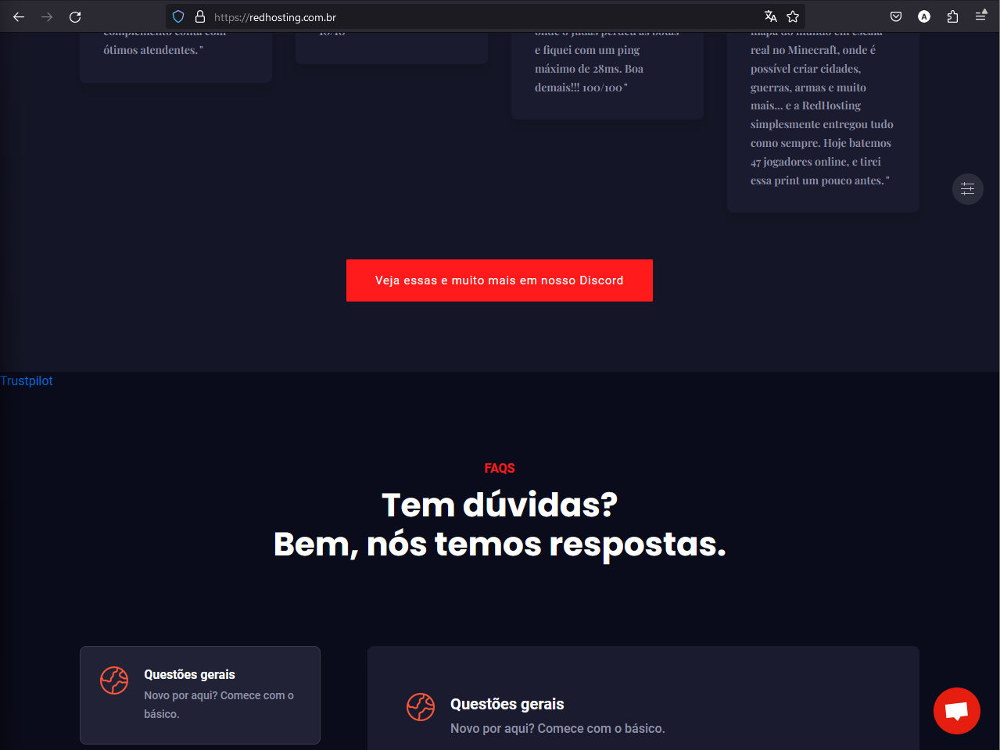

---
layout:
  title:
    visible: true
  description:
    visible: true
  tableOfContents:
    visible: true
  outline:
    visible: true
  pagination:
    visible: false
---

# Catálogo de hospedagem

Catálogo de todas as hospedagens observadas, juntamente com os pontos, links e anotações, apenas são considerados os planos de Minecraft.

A ordem no qual as hospedagens estão organizadas são as que mais batem com os pontos observados em ordem decrescente, funcionando em um meio de nota de 0 a 10, como explicado na página anterior.

## <mark style="color:red;">Importante</mark>

Em algumas avaliações foi entrado em contato com o suporte, isso será feito com todas as hospedagens no qual não dão informações suficientes em seus websites para a avaliação completa, estará claramente descrito caso alguma informação foi apenas possível conseguir pelo suporte, e com uma lista na página da hospedagem desta documentação com todos os pontos que foram apenas pegos pelo suporte.\
Caso alguma informação apenas foi possível de ser pega entrando em contato com o suporte, não irá contar na pontuação da hospedagem, e consequentemente em seu ranking, entretanto, ainda estará disponível nessa comparação. O objetivo dessa documentação é trazer maior transparência as hospedagens de Minecraft assim como compartilhar informações básicas sobre elas.\
Algumas hospedagens estão com avaliações feitas de maneiras antigas, estamos ativamente re-analisando todas para ficarem com o mesmo método.

## Utilização de cores na aba de informações

* <mark style="color:green;">Verde</mark>: Cumpriu totalmente o ponto observado
* <mark style="color:orange;">Laranja</mark>: Cumpriu parcialmente o ponto observado
* <mark style="color:red;">Vermelho</mark>: Não cumpriu o ponto observado

Mais informações sobre os pontos observados estará disponível na página dedicada àquela hospedagem dentro dessa documentação.

## MagnoHost.com.br | 7.4 

Data da avaliação - 25/01/2024

<table><thead><tr><th width="192">Ponto observado</th><th width="240">Informações</th><th width="218">Anotações</th><th>Pontos</th></tr></thead><tbody><tr><td>Localização</td><td>Brasil - São Paulo Estados Unidos - Miami</td><td></td><td></td></tr><tr><td>Legalidade</td><td><a href="https://cnpj.biz/53000870000127"><mark style="color:orange;">MEI</mark></a></td><td>Registrado de forma incorreta - <a href="https://docs.artbenedetti.com/iniciando-um-servidor/escolhendo-uma-hospedagem/legais">Explicação</a></td><td>15</td></tr><tr><td>Sistema Financeiro</td><td><mark style="color:red;">WHMCS Não Autorizado</mark></td><td></td><td>0</td></tr><tr><td>Avaliação</td><td><ul><li><a href="https://br.trustpilot.com/review/magnohost.com.br"><mark style="color:orange;">TrustPilot</mark></a></li><li><a href="https://www.reclameaqui.com.br/empresa/magnohost/"><mark style="color:orange;">ReclameAqui</mark></a></li></ul></td><td>TrustPilot e ReclameAqui estão citados no website, entretanto, não estão verificados</td><td>10</td></tr><tr><td>Uptime SLA</td><td><mark style="color:green;">99,97% - 5X</mark></td><td>Citado nos termos</td><td>10</td></tr><tr><td>Hardware</td><td>Brasil: - <mark style="color:green;">Ryzen 9 5900X -</mark> 3,471 - <mark style="color:green;">Ryzen 9 5950X -</mark> 3,466  Estados Unidos: - <mark style="color:green;">Ryzen 9 3900X -</mark> 2,707 - <mark style="color:green;">Ryzen 9 3950X -</mark> 2,706</td><td>A seleção é dependente da capacidade da máquina, preço é o mesmo independete do processador.</td><td>25</td></tr><tr><td>Proteção DDoS</td><td><mark style="color:red;">100Tbps</mark></td><td>Sem maiores informações sobre o provedor</td><td>0</td></tr><tr><td>Backups on/off-site</td><td><mark style="color:green;">off-site</mark></td><td>Dependendo do plano contratado, poderá ter 1-3 backups off-site</td><td>10</td></tr><tr><td>Compartilhamento de recursos</td><td><mark style="color:green;">Dedicados</mark></td><td>Planos dedicados estão disponíveis para hospedagens dos Estados Unidos, sendo contratada uma VPS e, então, gerenciada pela MagnoHost.</td><td>10</td></tr><tr><td>Práticas insustentáveis</td><td>- <mark style="color:green;">Planos vitalícios</mark> - <mark style="color:green;">Planos ilimitados</mark> - <mark style="color:green;">Fração inconsistente</mark></td><td>Todos os planos estão com uma fração consistente.</td><td>30</td></tr><tr><td>Transparência</td><td>- <mark style="color:green;">Página de uptime</mark> - <mark style="color:green;">Página de recursos</mark></td><td><ul><li>Contém uma página de uptime com o uso de recursos dos nodes US 1 e 2</li></ul></td><td>25</td></tr><tr><td>Adicionais</td><td>- <mark style="color:green;">Server Splitter</mark> - <mark style="color:green;">Seleção de versão</mark> - <mark style="color:green;">Subdomínios</mark> - <mark style="color:green;">Lixeira</mark></td><td></td><td>6</td></tr></tbody></table>

***

A MagnoHost ofereceu no dia 24/01/2024 uma hospedagem de testes para pegar essas informações, qualquer informação e avaliação aqui não está nem a favor ou contra a MagnoHost devido a este fato.

Informações conseguidas pelo suporte

MagnoHost tem falta de transparência em seu website e página de produtos sobre algumas informações, entretanto, as informações faltantes não são significativas na experiência:

* Divisor de servidor: O limite de quantas divisões pode ser feitas é dependente do plano, entretanto, pode ser aumentado apenas por entrar em contato com o suporte.
* Recursos dedicados: Segundo o suporte, gerenciam e instalam Pterodactyl nas VPS da empresa, no qual estão com recursos dedicados.



<figure><figcaption></figcaption></figure>



<figure><figcaption></figcaption></figure>



<figure><figcaption></figcaption></figure>

O seletor de versões tem os seguintes softwares disponíveis:

* Paper Spigot
* Mohist
* PufferFish
* Purpur
* Magma
* ArchLight
* Spigot
* PocketMine



<figure><figcaption></figcaption></figure>



<figure><figcaption></figcaption></figure>



**Cálculo de pontuação**:

`(<Pontuação>*10)/<Pontuação Máxima>=Nota` -> `(141*10)/190=Nota` -> 7.42

Histórico de alterações

25/01/2024 - Adicionou backups off-site\
\
27/01/2024 - \
1\. Adicionou hospedagem brasileira\
2\. Adicionou citação de planos dedicados para hospedagem dos Estados Unidos\
3\. Alterou o processador do plano do Estados Unidos de 3950X/5950X para 3900X/3950X\
4\. Alterou a proteção DDoS de 200Tbps para 100Tbps

## ElgaeHost.com.br | 6 

Data de avaliação - 27/01/2024

<table><thead><tr><th width="192">Ponto observado</th><th width="240">Informações</th><th width="218">Anotações</th><th>Pontos</th></tr></thead><tbody><tr><td>Localização</td><td>Brasil - Cotia/São Paulo</td><td></td><td></td></tr><tr><td>Legalidade</td><td><a href="https://cnpj.biz/46853968000161"><mark style="color:orange;">MEI</mark></a></td><td>Registrado de forma incorreta - <a href="https://docs.artbenedetti.com/iniciando-um-servidor/escolhendo-uma-hospedagem/legais">Explicação</a></td><td>15</td></tr><tr><td>Sistema Financeiro</td><td><mark style="color:green;">WHMCS</mark></td><td>Autorizada a utilizar</td><td>20</td></tr><tr><td>Avaliação</td><td><a href="https://br.trustpilot.com/review/elgaehost.com.br"><mark style="color:green;">TrustPilot</mark></a> <a href="https://www.reclameaqui.com.br/empresa/elgae-host/"><mark style="color:orange;">ReclameAqui</mark></a></td><td>TrustPilot está citado e verificado ReclameAqui está citado mas não verificada</td><td>10</td></tr><tr><td>Uptime SLA</td><td><mark style="color:red;">Inconsistente</mark></td><td>

<ul><li>Compensação não citada</li><li>Ausente nos termos</li><li>Página inicial relata 99%, página de produtos (Minecraft avançado e dedicado) relata 99.99%</li></ul></td><td>0</td></tr><tr><td>Hardware</td><td><mark style="color:green;">Ryzen 9 7950X -</mark> 4,297 <mark style="color:green;">Ryzen 9 7900X</mark> - 4,284</td><td>A escolha do processador dependará da capacidade da hospedagem</td><td>25</td></tr><tr><td>Proteção DDoS</td><td><mark style="color:green;">228Tbps - Cloudflare Magic Transit &#x26; ShieldM</mark></td><td></td><td>15</td></tr><tr><td>Backups on/off-site</td><td><mark style="color:red;">on-site</mark></td><td>Segundo o suporte, os backups realizados são totalmente on-site</td><td>0</td></tr><tr><td>Compartilhamento de recursos</td><td><mark style="color:orange;">Dedicados</mark></td><td>Plano com recursos dedicados está em pré-venda, <mark style="color:red;">não acarretará pontos até o seu lançamento.</mark></td><td>0</td></tr><tr><td>Práticas insustentáveis</td><td>- <mark style="color:green;">Planos vitalícios</mark> - <mark style="color:red;">Planos ilimitados</mark> - <mark style="color:red;">Fração inconsistente</mark></td><td><ul><li>Não oferece planos vitalícios</li><li>Recursos ilimitados presentes em seus planos básicos</li><li>Fração inconsistente de recursos em seus planos avançados</li></ul></td><td>10</td></tr><tr><td>Transparência</td><td>- <a href="https://status.elgaehost.com.br/"><mark style="color:green;">Página de uptime</mark></a> - <mark style="color:red;">Página de recursos</mark></td><td><ul><li>Contém uma página de uptime, mas sem o uso de recursos.</li></ul></td><td>5</td></tr><tr><td>Adicionais</td><td>
- <mark style="color:green;">Server Splitter</mark>

- <mark style="color:green;">Loja de servidor (SynceMarket)</mark> - <mark style="color:green;">Backup de database</mark> - <mark style="color:green;">Instalador de versões</mark> - <mark style="color:green;">Instalador de plugins</mark> - <mark style="color:green;">Instalador de mods</mark> - <mark style="color:green;">Subdomínios</mark> - <mark style="color:green;">Pesquisa Inteligente</mark> - <mark style="color:green;">Portas Internas</mark>
</td><td><ul><li>A loja de servidor está incluso nos planos avançados</li><li>A quantidade de servidores adicionais dependerá do plano escolhido </li></ul></td><td>14</td></tr></tbody></table>

Foi utilizado o teste grátis da ElgaeHost para pegar essas informações, qualquer informação e avaliação aqui não está nem a favor ou contra a ElgaeHost devido a este fato.



<figure><figcaption></figcaption></figure>



<figure><figcaption></figcaption></figure>

No Server Splitter da Elgae é possível criar servidores, o egg pode ser alterado após a criação do servidor, com possibilidade de editar os recursos após a criação.



<figure><figcaption></figcaption></figure>

Os backups da Elgae (Tanto para database quando para o servidor) ficam separados dos feitos manualmente e dos feitos automaticamente.



<figure><figcaption></figcaption></figure>

Os softwares disponíveis para a seleção são:

* Vanilla
* Snapshot
* Spigot
* Paper
* Purpur
* Sponge
* Bungeecord
* Waterfall
* Velocity
* Fabric
* Mohist



<figure><figcaption></figcaption></figure>

Os mods da lista são pegos do Spigot, Modrinth e Polymart



<figure><figcaption></figcaption></figure>

Os mods da lista são pegos do CurseForge



<figure><figcaption></figcaption></figure>

Para subdomínios apenas existe uma seleção, elgaehost.com.br



<figure><figcaption></figcaption></figure>

A pesquisa da Elgae é capaz de pesquisar arquivos, informações dentro dos arquivos e dentro de backups.



<figure><figcaption></figcaption></figure>

É possível a criação de portas internas, estão são, apenas acessíveis dentro da mesma máquina, assim permitindo uma conexão mais segura e privada para networks.



**Cálculo de pontuação**:

`(<Pontuação>*10)/<Pontuação Máxima>=Nota` -> `(114*10)/190=Nota` -> 6

## Syrtex.com.br | 5.6 

Data da avaliação - 26/01/2024&#x20;

<table><thead><tr><th width="192">Ponto observado</th><th width="240">Informações</th><th width="218">Anotações</th><th>Pontos</th></tr></thead><tbody><tr><td>Localização</td><td>Brasil - São Paulo / Rio Grande do Sul / Rio de Janeiro Estados Unidos - Miami</td><td>Pelo suporte foi possível descobrir as cidades em específico.</td><td></td></tr><tr><td>Legalidade</td><td><a href="https://cnpj.biz/49565390000136"><mark style="color:orange;">MEI</mark></a></td><td>Registrado de forma incorreta - <a href="../../escolhendo-uma-hospedagem/legais.md">Explicação</a></td><td>15</td></tr><tr><td>Sistema Financeiro</td><td><mark style="color:red;">WHMCS Não Autorizado</mark></td><td></td><td>0</td></tr><tr><td>Avaliação</td><td><a href="https://www.trustpilot.com/review/syrtex.cloud"><mark style="color:green;">TrustPilot</mark></a></td><td></td><td>10</td></tr><tr><td>Uptime SLA</td><td><mark style="color:green;">99.9% - 1x</mark></td><td>Uptime está listado na página de sobre da Syrtex.</td><td>10</td></tr><tr><td>Hardware</td><td>Brasil: - <mark style="color:green;">Ryzen 9 5900X -</mark> 3,471 - <mark style="color:green;">Ryzen 9 5950X -</mark> 3,466  Estados Unidos: - <mark style="color:green;">Ryzen 9 3900X -</mark> 2,707 - <mark style="color:green;">Ryzen 9 5900X -</mark> 3,471</td><td><mark style="color:red;">Dependendo de qual processador for alocado ao cliente na hospedagem dos Estados Unidos, poderá ter uma diferença máximo teórica e sintética de até 28%.</mark></td><td>25</td></tr><tr><td>Proteção DDoS</td><td><mark style="color:green;">SyrtexShield - 200Tbps</mark></td><td>Relata ser uma implementação própria da Syrtex, mais informações a baixo.</td><td>15</td></tr><tr><td>Backups on/off-site</td><td><mark style="color:red;">on-site</mark></td><td>Os backups realizados pelo cliente, segundo o suporte, fica salvo dentro da mesma máquina do servidor e em outra máquina, entretanto, por estar no mesmo datacenter ainda é considerado on-site.</td><td>0</td></tr><tr><td>Compartilhamento de recursos</td><td><mark style="color:green;">Dedicados</mark></td><td>Os planos da série "Dedicado" relatam ter recursos dedicados, mais informações a baixo.</td><td>10</td></tr><tr><td>Práticas insustentáveis</td><td>- <mark style="color:green;">Planos vitalícios</mark> - <mark style="color:red;">Planos ilimitados</mark> - <mark style="color:red;">Fração inconsistente</mark></td><td><ul><li>Contém RAM ilimitada em seus planos ilimitados</li><li>Fração de recursos se demonstra inconsistente nos planos dedicados, variando de 1-1.66GB de armazenamento por GB de ram, e variando de 10-80% de processador por GB de ram.</li></ul></td><td>10</td></tr><tr><td>Transparência</td><td>- <mark style="color:green;">Página de uptime</mark> - <mark style="color:red;">Página de recursos</mark></td><td><ul><li>Contém uma página de uptime com o histórico</li></ul></td><td>5</td></tr><tr><td>Adicionais</td><td>
<mark style="color:green;">- Server Splitter</mark>

<mark style="color:green;">- Subdomínios</mark> <mark style="color:green;">- Loja de servidor inclusa (PayCraft)</mark>
</td><td>- Loja de servidor inclusa em alguns planos específicos (Acima de 6GBs)</td><td>7</td></tr></tbody></table>

***

Informações conseguidas pelo suporte

Syrtex tem falta de transparência em seu website e página de produtos sobre algumas informações, as seguintes apenas foi possível conseguir com o suporte ou de formas externas:

* Localização da hospedagem: No website está apenas citado Estados Unidos ou Brasil, sem a localização mais específica, como MIami, Rio Grande do Sul, Rio de Janeiro e São Paulo.
* Processador: Pelo suporte foi possível descobrir uma discrepância dos processadores citados no website e dos processadores utilizados, com tanto Estados Unidos e Brasil utilizando Ryzen 9 5900/5950X, diferente do oferecido. Sendo Ryzen 9 3900X/5900X para os Estados Unidos e Ryzen 9 5900X/5950X para o Brasil.
* Proteção DDoS: Pelo suporte foi possível descobrir mais informações sobre a proteção DDoS da Syrtex, relatando o seguinte:
  * > 1. A proteção Anti DDoS da nossa Shield opera baseando-se em mascaras de rede e sub rede, com protocolos e interfaces limitados, que por sua vez, operam de acordo com a degradação parcial do serviço, ou seja, o protocolo utilizado faz com que o serviço que seja afetado continue operando normalmente, isento de ataques. Operamos com o desvio para redes da cloud flare integrada para melhor performance.
    > 2. Também com uma série de protocolos de segurança e proteção privadas
    > 3. Garantimos +200 TBps de proteção

<!---->

* Plano Dedicado: A alocação de núcleos não é completa nos planos dedicados, porém, segundo o suporte, garante que o mesmo núcleo ainda será dedicado ao cliente e o restante para o sistema, alocação incomum, porém, ainda considerado recursos dedicados.

<!---->

* Backups classificados como on-site: Foi possível saber pelo suporte que os backups são on-site.



<figure><figcaption></figcaption></figure>



<figure><figcaption></figcaption></figure>



<figure><figcaption></figcaption></figure>



Cálculo de pontuação:

`(<Pontuação>*10)/<Pontuação Máxima>=Nota`-> `(107*10)/190=Nota` -> 5.63

## BedHosting.com.br | 4.2 

Data da avaliação - 24/01/2024

<table><thead><tr><th width="192">Ponto observado</th><th width="240">Informações</th><th width="218">Anotações</th><th>Pontos</th></tr></thead><tbody><tr><td>Localização</td><td>Brasil - São Paulo ou Minas Gerais Estados Unidos - Virgínia Canadá - Quebec</td><td>Sem mais informações sobre a localização específica no website da empresa. Foi possível saber a localização mais exata entrando em contato com o suporte.</td><td></td></tr><tr><td>Legalidade</td><td><a href="https://cnpj.biz/48964455000153"><mark style="color:orange;">MEI</mark></a></td><td>Registrado de forma incorreta -  <a href="https://docs.artbenedetti.com/iniciando-um-servidor/escolhendo-uma-hospedagem/legais">Explicação</a></td><td>15</td></tr><tr><td>Sistema Financeiro</td><td><mark style="color:green;">WHMCS</mark></td><td>Autorizado a utilizar pelo WHMCS</td><td>20</td></tr><tr><td>Avaliação</td><td><mark style="color:red;">TrustPilot</mark></td><td>TrustPilot da empresa existe, entretanto, não está citado no site e nem verificado</td><td>0</td></tr><tr><td>Uptime SLA</td><td><mark style="color:green;">99,7% - 2x</mark></td><td>Sem compensação citada nos termos, só foi possível descobrir após entrar em contato com o suporte, sendo 2x.  <mark style="color:red;">Pela compensação não estar citada nos termos ou website, não arrecadará pontos.</mark></td><td>0</td></tr><tr><td>Hardware</td><td>
<strong>Brasil</strong>
<ul><li>Basic: <mark style="color:red;">ARM 3.0GHz  ou Xeon E5-2690v4 -</mark> 2,075</li><li>Plus: <mark style="color:green;">Ryzen 9 5950X -</mark> 3,466</li><li>Ultra: <mark style="color:green;">Ryzen 9 7950X -</mark> 4,297</li></ul>
<strong>Estados Unidos</strong>
<ul><li><mark style="color:green;">Ryzen 5 5600X -</mark> 3,361</li></ul>
<strong>Canadá</strong>
<ul><li><mark style="color:green;">Ryzen 7 5800X -</mark> 3,448</li></ul></td><td>

<ul><li>Só foi possível saber que a hospedagem Basic também pode ser entregue com o Xeon pelo suporte, a escolha é dependente da capacidade.</li></ul><ul><li>Só foi possível saber que o ARM é de 3.0GHz após entrar em contato com o suporte.</li></ul></td><td>20</td></tr><tr><td>Proteção DDoS</td><td><mark style="color:green;">228Tbps - Cloudflare Magic Transit</mark></td><td>Proteção DDoS está citada, em alguns casos como "BedGuard", na página do plano Ultra tras uma capacidade de 228Tbps, mas sem o provedor. Após entrar em contato com o suporte foi possível descobrir que é o Magic Transit da Cloudflare, com capacidade de 228Tbps.  <mark style="color:red;">Entretanto, por essa informação apenas ser encontrada pelo suporte, não arrecadará pontos.</mark></td><td>0</td></tr><tr><td>Backups on/off-site</td><td><mark style="color:green;">on-site e off-site</mark></td><td>Só foi possível descobrir, em contato com o suporte, os backups feitos pelos clientes ficam na mesma máquina, entretanto, backups completos do node são feitos periodicamente para outro local.</td><td>10</td></tr><tr><td>Compartilhamento de recursos</td><td><mark style="color:red;">Sem informação</mark></td><td>Em caso de falta de informação, é considerado compartilhado</td><td>0</td></tr><tr><td>Práticas insustentáveis</td><td>- <mark style="color:green;">Planos vitalícios</mark> - <mark style="color:green;">Planos ilimitados</mark> - <mark style="color:red;">Fração inconsistente</mark></td><td>Fração inconsistente de recursos em todos os planos referente ao processador e RAM, assim como o disco (10GB padrão, independente do plano)</td><td>20</td></tr><tr><td>Transparência</td><td>- <mark style="color:green;">Página de uptime</mark> - <mark style="color:red;">Página de recursos</mark></td><td>

<ul><li>Falta extrema de transparência do website e dos produtos/servicos, estas foram discutidas e anotadas na <a href="broken-reference">página específica da BedHosting</a>.</li></ul><ul><li>Contém uma página de Uptime, separada por nodes, mas não contém de uso de recursos.</li></ul></td><td>5</td></tr><tr><td>Adicionais</td><td><mark style="color:green;">Subdomínio</mark></td><td>Sem mais adicionais no painel</td><td>1</td></tr></tbody></table>

***

A BedHosting ofereceu no dia 24/01/2024 uma hospedagem de testes para pegar essas informações, qualquer informação e avaliação aqui não está nem a favor ou contra a Bedhosting devido a este fato.

Informações conseguidas pelo suporte

BedHosting tem falta de transparência em seu website e página de produtos sobre algumas informações, as seguintes apenas foi possível conseguir com o suporte ou de formas externas:

* Localização: A localização específica além do país não estava disponível no website, apenas foi possível descobrir que era São Paulo/Minas Gerais para o Brasil, Virginia para os Estados Unidos e Quebec para o Canadá por meio do suporte.
* Processador do Basic: Só foi possível descobrir que o plano Basic também pode vir com o processador Xeon E5-2690v4 por meio de contato com o suporte
* Processador da hospedagem dos Estados Unidos: Não está citado no site e em nenhum lugar, apenas está como "AMD Ryzen 5", sem especificação do modelo, com o suporte foi capaz de descobrir que é o Ryzen 5 5600X
* Proteção DDoS: Só foi possível descobrir que a proteção DDoS é da Cloudflare Magic Transit após entrar em contato com o suporte.
* Compensação SLA: Só foi possível descobrir que era de 2 vezes após entrar em contato com o Suporte.
* Backup on-site e off-site: Só foi possível descobrir pelo suporte que são feitos backups periódicos das máquinas de maneira off-site, entretanto, os backups feitos pelos clientes ainda são on-site:
  * > O backup feito diretamente pelo site de gerenciamento (Pterodactyl) é on-site ( no mesmo datacenter ) todavia efetuamos backups diarios (todo dia as 09:00AM) de todas os nodes em um outro datacenter destinado apenas para backup (off-site)



<figure><figcaption></figcaption></figure>



<figure><figcaption></figcaption></figure>



Cálculo de pontuação:

`(<Pontuação>*10)/<Pontuação Máxima>=Nota`-> `(81*10)/190=Nota` -> 4.26

## XMXCloud.net | 3.6 

Data da avaliação - 24/01/2024&#x20;

<table><thead><tr><th width="192">Ponto observado</th><th width="240">Informações</th><th width="218">Anotações</th><th>Pontos</th></tr></thead><tbody><tr><td>Localização</td><td>Brasil - São Paulo Estados Unidos - Miami/Nova Iorque</td><td>Informações da cidade específica estão na aba de produtos do WHMCS, não no website principal</td><td></td></tr><tr><td>Legalidade</td><td><mark style="color:red;">CNPJ ausente</mark></td><td></td><td>0</td></tr><tr><td>Sistema Financeiro</td><td><mark style="color:green;">WHMCS</mark></td><td>Autorizado a utilizar pelo WHMCS</td><td>20</td></tr><tr><td>Avaliação</td><td><mark style="color:red;">Sem website de avaliação</mark></td><td></td><td>0</td></tr><tr><td>Uptime SLA</td><td><mark style="color:red;">Sem informação sobre Uptime Garantido</mark></td><td>Uptime Garantido está ausente nos termos e no website, entretanto, a compensação está citada nos termos, sendo de 2x ("Para cada dia de indisponibilidade do serviço, o cliente receberá dois dias de bônus")</td><td>0</td></tr><tr><td>Hardware</td><td>
Brasil: - <mark style="color:green;">Xeon E-2356G</mark> - 3,368

Estados Unidos: - <mark style="color:green;">Ryzen 9 7900X -</mark> 4,284
</td><td>Enquanto utiliza um Xeon no plano brasileiro, ele é totalmente capaz de aguentar servidores comparado a sua performance single-core, entretanto, é apenas 6 núcleos e 12 threads</td><td>25</td></tr><tr><td>Proteção DDoS</td><td><mark style="color:red;">Citada</mark></td><td>Enquanto diz que oferece proteção DDoS, não cita em qualquer momento a capacidade ou o provedor.</td><td>0</td></tr><tr><td>Backups on/off-site</td><td><mark style="color:green;">on-site e off-site</mark></td><td>Após entrar em contato com o suporte, foi possível descobrir que a empresa reliazada backups periódicos para uma localização off-site, enquanto os backups feitos pelo painel continuam on-site.</td><td>10</td></tr><tr><td>Compartilhamento de recursos</td><td><mark style="color:red;">Sem informação</mark></td><td>Em caso de falta de informação, é considerado compartilhado</td><td>0</td></tr><tr><td>Práticas insustentáveis</td><td>- <mark style="color:green;">Planos vitalícios</mark> - <mark style="color:green;">Planos ilimitados</mark> - <mark style="color:red;">Fração inconsistente</mark></td><td>A empresa não diz qual o limite de processador alocado a cada plano, entretanto, a comparação de GBs de RAM e GBs de armazenamento está inconsistente.</td><td>20</td></tr><tr><td>Transparência</td><td>- <mark style="color:red;">Página de uptime</mark> - <mark style="color:red;">Página de recursos</mark></td><td><ul><li>A empresa não contém uma página de uptime e nem mesmo da utilização de recursos de cada node</li></ul><ul><li>A empresa não é clara sobre os serviços, não dando dados específicos sobre a localização na website principal, limite de processador, e a proteção garantida.</li></ul></td><td>0</td></tr><tr><td>Adicionais</td><td>- <mark style="color:green;">Subdomínios</mark> - <mark style="color:green;">Instalador de versões</mark> - <mark style="color:green;">Server Splitter</mark></td><td><ul><li>Instalador de versões e Server Splitter não citados no website</li></ul><ul><li>Após entrar em contato com o suporte, foi possível descobrir que o Server Splitter apenas funciona para planos acima de 8GB de ra</li></ul></td><td>5</td></tr></tbody></table>

***

Informações conseguidas pelo suporte

### Informações conseguidas pelo suporte

XMXCloud tem falta de transparência em seu website e página de produtos sobre algumas informações, as seguintes apenas foi possível conseguir com o suporte:

* Backup on-site e off-site: Só foi possível descobrir pelo suporte que são feitos backups periódicos das máquinas de maneira off-site, entretanto, os backups feitos pelos clientes ainda são on-site.
* Server Splitter: Só foi possível descobrir pelo suporte que penas está disponível para planos de 8GB ou superiores.

Informações conseguidas pelo painel

Essas são as informações que não foram citadas no website mas que foi possível pegar apenas tendo acesso ao painel

* Instalador de versões: Não está citado que inclui um instalador de versões no website, isso não é um ponto negativo diretamente.
* Server Splitter: Não está citado que inclui um server splitter no website, isso não é um ponto negativo diretamente.



<figure><figcaption></figcaption></figure>



<figure><figcaption></figcaption></figure>



<figure><figcaption></figcaption></figure>



<figure><figcaption></figcaption></figure>



Cálculo de pontuação:

`(<Pontuação>*10)/<Pontuação Máxima>=Nota`-> `(70*10)/190=Nota` -> 3.68

***

## <mark style="color:red;">As hospedagens abaixo foram avaliadas de um modo antigo, as informações poderão mudar e não tem uma nota de 0 a 10, irão ser adicionadas nesta página assim que as avaliações forem atualizadas</mark>


[catalogo.md](catalogo.md)



[arquivamento.md](arquivamento.md)

