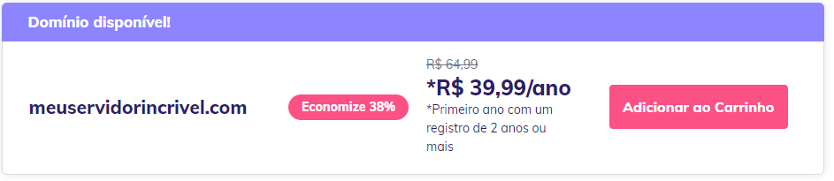
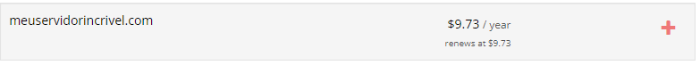

# Configurando domínio

Nesse tutorial veremos como configurar o seu próprio domínio para o seu servidor, como por exemplo, <mark style="color:yellow;">`seuservidor.com`</mark> ou <mark style="color:yellow;">`jogar.seuservidor.com`</mark>.\
\
Para isso, você primeiro precisará ter esse domínio, ele poderá ser comprado de várias empresas e companhias diferentes, tais como Cloudflare, Hostinger, Porkbun, etc.

### O que levar em consideração na compra de um domínio

#### Preço do primeiro ano e o preço dos anos seguintes

Em muitos casos, o preço do primeiro ano será muito menor do que os anos recorrentes, abaixo vemos alguns exemplos:

<figure><figcaption></figcaption></figure>

Nessa imagem acima, podemos perceber que o primeiro ano para o domínio <mark style="color:yellow;">`meuservidorincrivel.com`</mark> comprado na <mark style="color:yellow;">`hostinger`</mark> é R$39.99/Ano com um contrato de 2 anos, porém, os anos seguintes serão R$64.99/Ano

<figure><figcaption></figcaption></figure>

Nessa imagem acima, podemos perceber que o primeiro ano para o domínio <mark style="color:yellow;">`meuservidorincrivel.com`</mark> comprado na <mark style="color:yellow;">`porkbun`</mark>é R$39.99/Ano com um contrato de 2 anos, porém, os anos seguintes serão R$64.99/Ano
